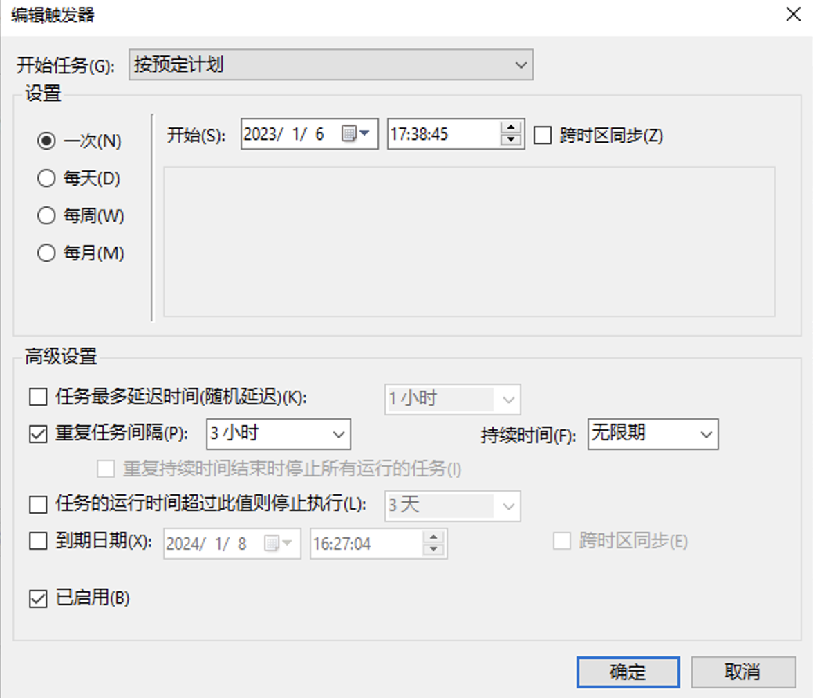

# Windows 怎样使用 Git 自动提交来备份重要文件

公司的一些公共资源都是放到共享里边的，但是之前有一天共享服务器被下了勒索病毒，导致所有文件都不能用了，而这些文件虽然相对重要，但是也没到交钱那一步，所以就当倒霉了。

后来，我就把共享中前端目录初始化成了 Git 仓库来进行备份，不过在共享中我们也不知道什么时候谁进行了修改，总不能每天手动去运行命令提交，那就太麻烦了，所以就写了个提交脚本，搞了个定时任务来自动提交。


## 编写提交代码的脚本

既然要用 Git，那电脑上肯定有 Git Bash，所以我们直接编写个非常非常简单的 shell 脚本来提交代码即可。

``` bash
# 进入目录，改成自己本地仓库的 path 即可
cd //192.168.1.80/samba1/前端------前端------前端

git add .
git status
git commit -m "update"
git push -f
git status
```

可以运行脚本测试一下是否存在问题。

## 设置 Windows 任务计划程序

Windows 中可以使用系统自带的“任务计划程序”来设置定时任务，操作如下：


### 搜索任务计划程序并打开


### 创建任务


### 设置任务名称


### 新建触发器



### 新建操作

**程序或脚本**选择 Git Bash 的程序路径，我的电脑是 `"D:\Program Files\Git\git-bash.exe"`。

**参数**写之前编写好的脚本路径 `\\192.168.1.80\samba1\前端------前端------前端\push.sh`。


### 大功告成

确定以后运行任务试试吧，不要忘了在仓库中修改点东西哦～


