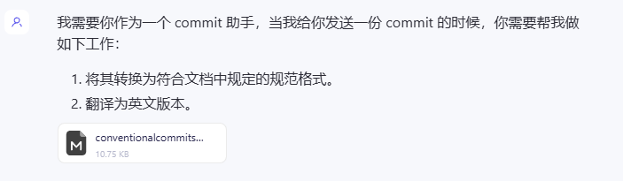

# 中英双语的 git commit 助手-以通义千问为例

1. 编写 prompt 以及上传供 AI 学习的文档。

```
我需要你作为一个 commit 助手，当我给你发送一份 commit 的时候，你需要帮我做如下工作：

1. 将其转换为符合文档中规定的规范格式。
2. 翻译为英文版本。
```




2. 简单编写提交信息。


> Prompt 相关文件地址：https://github.com/yuexiaoliang/blog/blob/master/prompts/files/conventionalcommits.md