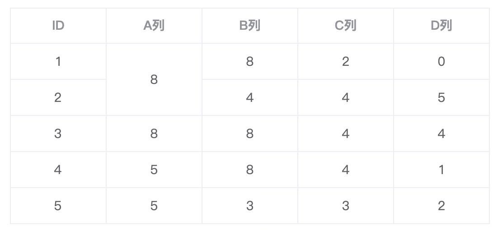
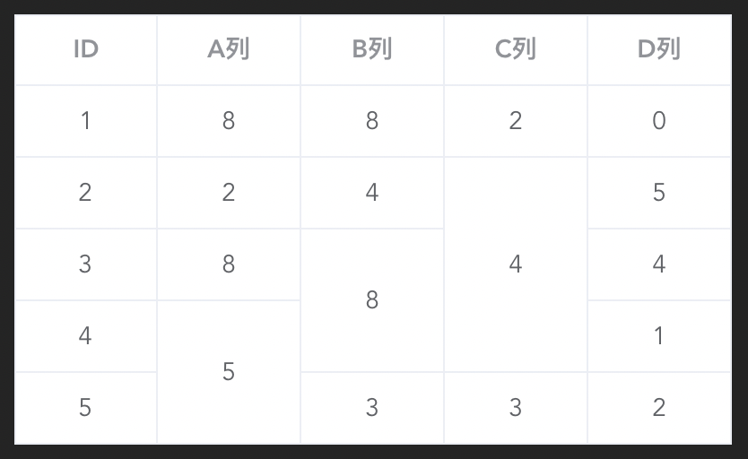

# 极佳、极简、通用的表格（Table）合并单元格方案

笔者一直有个开源梦，但是奈何时间有限、技术有限一直没有真正的开始过，2022 年 10 月 01 日，我决定走出这一步。

在工作中，经常会遇到一些表格，尤其是后台项目表格更多，而既然是表格，就免不了要合并单元格。之前很多次都是每次用到的时候直接写对应逻辑，但是这显然会很繁琐，于是趁着这个机会，我决定做一个用起来很方便的用于合并表格的开源库。

## 思路解析

很多 UI 库合并单元格的方式都是提供一个方式让我们可以根据自己的需求传递一个方法控制某些单元格的 `rowspan` 或 `colspan` 达到合并需求。比如*element-plus*提供了 `span-method` 属性，我们可以写一个方法给坐标（ ps：`[行, 列]`） 为 `[0, 1]` 的单元格设置 `rowspan` 为 `2`，`[1, 1]` 的单元格设置 `rowspan` 为 `0`，那么 `[0, 1]` 的单元格将占 2 行，而 `[1, 1]` 的单元格不会渲染，效果如下：



```js
// 代码

const spanMethod = ({ rowIndex, columnIndex }) => {
  let rowspan = 1;
  let colspan = 1;

  if (rowIndex === 0 && columnIndex === 1) rowspan = 2;
  if (rowIndex === 1 && columnIndex === 1) rowspan = 0;

  return {
    rowspan,
    colspan
  };
};
```

其实这里有个很重要的点，那就是*element-plus*我们提供了当前单元格的 `rowIndex` 以及 `columnIndex` 让我们可以控制每一个单元格的 `rowspan` 以及 `colspan`，笔者也分析过其他一些 UI 库，几乎都提供了类似的方式供我们使用。

基于上述部分的内容笔者就在想，如果提前利用表格数据解析出一份虚拟表格，虚拟表格中每一个单元格的内容就是渲染表格中每一个单元格的 `rowspan` 以及 `colspan` 值，然后利用组件库提供的 `rowIndex` 以及 `colIndex` 在我们设置好的虚拟表格中找到每一个单元格的 `rowspan` 以及 `colspan` 就可以实现表格单元格合并了。

## table-merge

基于上述思路，笔者开发了本文主角**table-merge**，已经开源到  [Github](https://github.com/yuexiaoliang/table-merge)  以及  [NPM](https://www.npmjs.com/package/table-merge)，并且支持多个 UI 框架开箱即用，会在本文最后列出。

例如*element-plus*想实现表格行合并，只需要很少的代码即可实现如下效果：



```jsx
// 代码
import tableMerge from '@table-merge/element-plus';

const data = [
  { id: 1, a: 8, b: 8, c: 2, d: 0 },
  { id: 2, a: 2, b: 4, c: 4, d: 5 },
  { id: 3, a: 8, b: 8, c: 4, d: 4 },
  { id: 4, a: 5, b: 8, c: 4, d: 1 },
  { id: 5, a: 5, b: 3, c: 3, d: 2 }
];

const columns = [
  { prop: 'id', label: 'ID', align: 'center' },
  { prop: 'a', label: 'A列', align: 'center' },
  { prop: 'b', label: 'B列', align: 'center' },
  { prop: 'c', label: 'C列', align: 'center' },
  { prop: 'd', label: 'D列', align: 'center' }
];


<el-table :data="data" :span-method="tableMerge(data)" border>
  <el-table-column v-for="col in columns" :key="col.prop" v-bind="col"></el-table-column>
</el-table>
```

更多灵活的使用方式可以参考上述链接中的使用文档。

## 开箱即用

[@table-merge/element-ui](https://github.com/yuexiaoliang/table-merge/tree/master/packages/element-ui)

[@table-merge/element-plus](https://github.com/yuexiaoliang/table-merge/tree/master/packages/element-plus)

[@table-merge/ant-design](https://github.com/yuexiaoliang/table-merge/tree/master/packages/ant-design)

[@table-merge/ant-design-vue](https://github.com/yuexiaoliang/table-merge/tree/master/packages/ant-design-vue)

最后，希望本库可以帮助到别人！
